# End to End Three-Tier DevSecops Web Application Deployment on AWS EKS using AWS EKS, ArgoCD, Prometheus, Grafana, and Jenkins CI/CD 

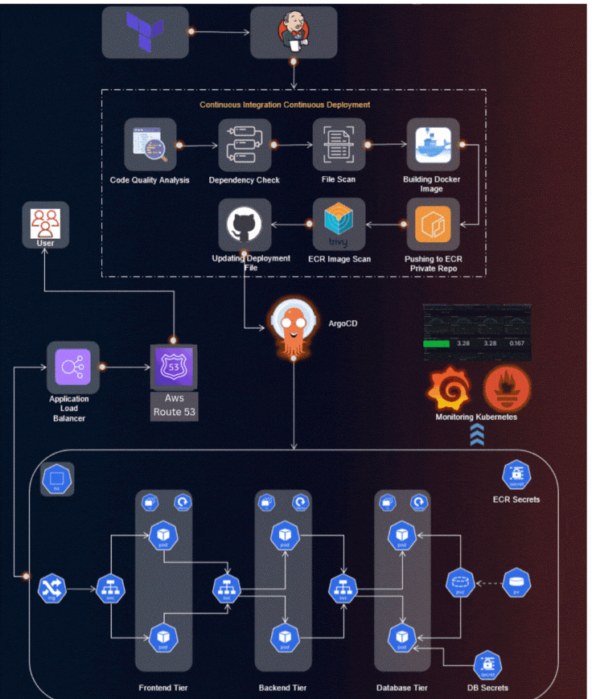

📋 Project Overview
This repository contains a complete implementation of a DevSecOps pipeline for deploying a three-tier application (React frontend, Node.js backend, MongoDB) on AWS EKS using industry best practices. The project integrates security scanning, GitOps-based deployment, and comprehensive monitoring.

## Table of Contents
- [Application Code]
- [Jenkins Pipeline Code]
- [Jenkins Server Terraform]
- [Kubernetes Manifests Files]

### Project structure
.
├── application-code/
│   └── backend/
├── frontend/
├── kubernetes/
│   ├── backend/
│   ├── frontend/
│   ├── Database/
│   └── ingress/
├── bootstrap-phase-terraform/
├── terraform-jenkins/
├── Jenkins-pipeline-code/
└── README.md

## Project Details
🛠️ **Tools Explored:**
- Terraform & AWS CLI for AWS infrastructure
- Jenkins, Sonarqube, Terraform, Kubectl, and more for CI/CD setup
- Helm, Prometheus, and Grafana for Monitoring
- ArgoCD for GitOps practices

## Implementation Steps

1. ### Backend Infrastructure Setup from bootstrap-phase-terraform folder
Create an S3 bucket and DynamoDB table using Terraform for Terraform state locking.

Store state for Jenkins and EKS infrastructure.

2. ### Provision Jenkins Server
Use Terraform to launch an EC2 instance for Jenkins (jenkins-Server-TF/).

Configure Jenkins with necessary inbound rules and IAM roles.

3. ### Set Up Jenkins Server
SSH into the Jenkins EC2 instance.
check the Jenkins and essential tools installed or not from the tools-install.sh:
Docker, Git, AWS CLI, kubectl, Terraform, JDK, Trivy, SonarQube Scanner

Start Jenkins and access via browser.

4. ### Install the required plugins and configure the plugins to deploy our Three-Tier Application
Install the following plugins by going to Dashboard -> Manage Jenkins -> Plugins -> Available Plugins

Docker
Docker Commons
Docker Pipeline
Docker API
docker-build-step
Eclipse Temurin installer
NodeJS
OWASP Dependency-Check
SonarQube Scanner
AWS Credentials
Pipeline: AWS Steps

5. ### Configure Jenkins Tools & Credentials
Define Git, JDK, Docker, SonarQube, Trivy in Global Tool Config.

Add credentials for AWS, GitHub, ECR, SonarQube, ArgoCD.
### Commands i used to install eck cluster and load balance, ingress and helm service.
1. Create an eks cluster using the below commands.
eksctl create cluster --name Three-Tier-K8s-EKS-Cluster --region us-east-1 --node-type t2.medium --nodes-min 2 --nodes-max 2
aws eks update-kubeconfig --region us-east-1 --name Three-Tier-K8s-EKS-Cluster

Once your cluster is created, you can validate whether your nodes are ready or not by the below command run 

kubectl get nodes
2. Now, we will configure the Load Balancer on our EKS because our application will have an ingress controller.
Download the policy for the LoadBalancer prerequisite.
curl -O https://raw.githubusercontent.com/kubernetes-sigs/aws-load-balancer-controller/v2.5.4/docs/install/iam_policy.json
Create the IAM policy using the below command
aws iam create-policy --policy-name AWSLoadBalancerControllerIAMPolicy --policy-document file://iam_policy.json

Create OIDC Provider

eksctl utils associate-iam-oidc-provider --region=us-east-1 --cluster=Three-Tier-K8s-EKS-Cluster --approve

Create a Service Account by using below command and replace your account ID with your one

eksctl create iamserviceaccount --cluster=Three-Tier-K8s-EKS-Cluster --namespace=kube-system --name=aws-load-balancer-controller --role-name AmazonEKSLoadBalancerControllerRole --attach-policy-arn=arn:aws:iam::<your_account_id>:policy/AWSLoadBalancerControllerIAMPolicy --approve --region=us-east-1

Run the below command to deploy the AWS Load Balancer Controller

sudo snap install helm --classic
helm repo add eks https://aws.github.io/eks-charts
helm repo update eks
helm install aws-load-balancer-controller eks/aws-load-balancer-controller -n kube-system --set clusterName=my-cluster --set serviceAccount.create=false --set serviceAccount.name=aws-load-balancer-controller

check whether your pods are running or not.

kubectl get deployment -n kube-system aws-load-balancer-controller

If the pods are getting Error or CrashLoopBackOff, then use the below command

helm upgrade -i aws-load-balancer-controller eks/aws-load-balancer-controller \
  --set clusterName=<cluster-name> \
  --set serviceAccount.create=false \
  --set serviceAccount.name=aws-load-balancer-controller \
  --set region=us-west-1 --set vpcId=<vpc#> -n kube-system
6. ### We need to create Amazon ECR Private Repositories for both Tiers (Frontend & Backend)

7. ### Install & Configure ArgoCD
kubectl create namespace three-tier

 when we try to push images to the ECR Repos it will give us the error Imagepullerror.

To get rid of this error, we will create a secret for our ECR Repo by the below command and then, we will add this secret to the deployment file.

Note: The Secrets are coming from the .docker/config.json file which is created while login the ECR in the earlier steps

kubectl create secret generic ecr-registry-secret \
  --from-file=.dockerconfigjson=${HOME}/.docker/config.json \
  --type=kubernetes.io/dockerconfigjson --namespace three-tier
kubectl get secrets -n three-tier

Now, we will install argoCD.

To do that, create a separate namespace for it and apply the argocd configuration for installation.

kubectl create namespace argocd
kubectl apply -n argocd -f https://raw.githubusercontent.com/argoproj/argo-cd/v2.4.7/manifests/install.yaml

All pods must be running, to validate run the below command

kubectl get pods -n argocd
Now, expose the argoCD server as LoadBalancer using the below command

kubectl patch svc argocd-server -n argocd -p '{"spec": {"type": "LoadBalancer"}}'

You can validate whether the Load Balancer is created or not by going to the AWS Console at this point 
To access the argoCD, copy the LoadBalancer DNS and hit on your favorite browser.

You will get a warning like the below snippet.

Click on Advanced.
Now, we need to get the password for our argoCD server to perform the deployment.

To do that, we have a pre-requisite which is jq. Install it by the command below.

sudo apt install jq -y
export ARGOCD_SERVER='kubectl get svc argocd-server -n argocd -o json | jq - raw-output '.status.loadBalancer.ingress[0].hostname''
export ARGO_PWD=$(kubectl -n argocd get secret argocd-initial-admin-secret -o jsonpath="{.data.password}" | base64 -d)
echo $ARGO_PWD
Enter the username and password in argoCD and click on SIGN IN.

8. ### we have to configure Sonarqube for our DevSecOps Pipeline also check sonarscanner installed or not at this stage.

Generate sonar-tokens, webhooks, for both frontend, backend.
9. ###  check  the configure  credentials sonarqube to assign to jenkins also others like

 jdk(version jdk 17.0.1+12),sonarqube-scanner,nodejs(version 14.0.0), Dependency-Check 9.0.9, docker(latest)
 we have to set the path for Sonarqube in Jenkins

10.  ### CI/CD Pipelines
Store Jenkinsfiles in Jenkins-pipeline-code/

### Pipelines perform:

Code checkout

Docker build & push

Trivy scan

SonarQube analysis

Git push to ArgoCD repo (for GitOps)

7. ### Deploy Kubernetes Resources
Define all manifests inside kubernetes-Manifests-file/

Frontend, backend, database deployments and Ingress
Push manifests to Git repo watched by ArgoCD.

8. ### Set Up GitOps with ArgoCD
Install ArgoCD on EKS cluster.

Connect it to your manifest Git repository.

Let ArgoCD auto-sync changes to the cluster
Confirm LoadBalancer is provisioned and reachable.

9. ###  Configure Route 53 and DNS
Create a public hosted zone in Route 53

Point a domain/subdomain (e.g., devops.yourdomain.com) to the Ingress controller’s external IP

Create an A record (alias) in Route 53 targeting the ALB created by the Ingress controller

9. Monitoring Setup
Install Prometheus and Grafana using Helm or manifests.

Expose dashboards for pipeline and app monitoring.

✅ Final Outcome
1. Code pushed to GitHub → Jenkins triggers CI

2. Docker images built, scanned, tested → pushed to ECR

3. Kubernetes manifests updated in Git → ArgoCD applies changes

4. Ingress routes traffic → TLS secured with cert-manager

5. Observability via Prometheus & Grafana
Images taken while doing this project 
1. GitHub Credentials Setup
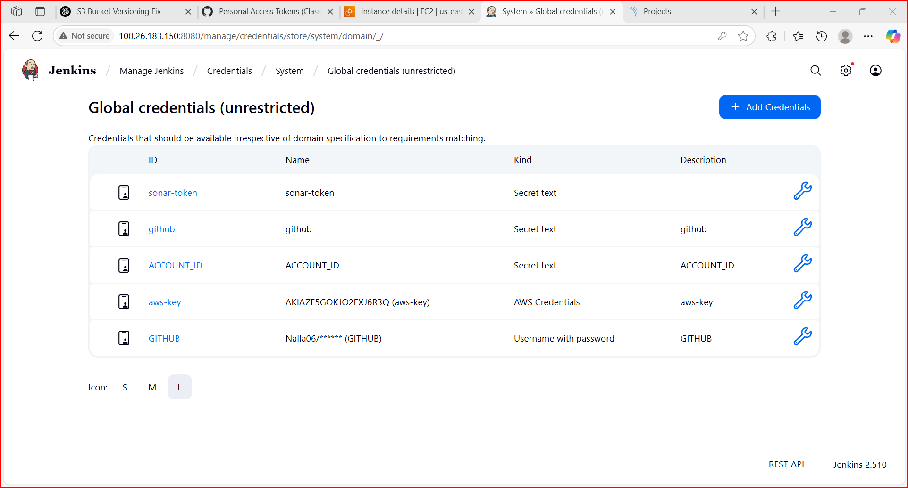
2. Jenkins UI First Login (or Jenkins Setup)
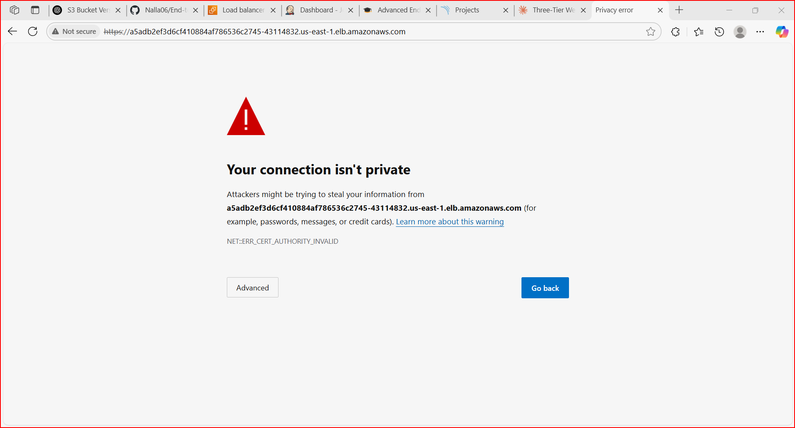
3. Initial Jenkins Configuration
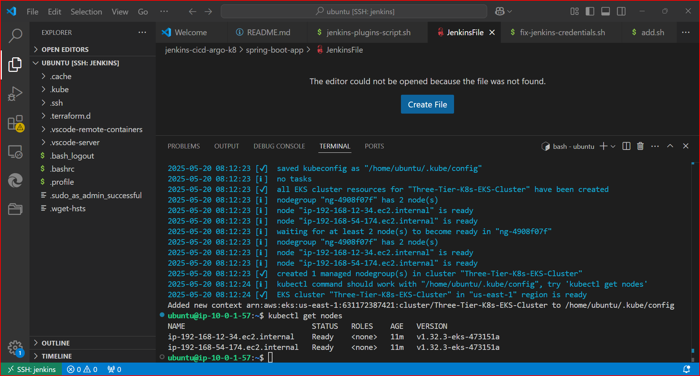
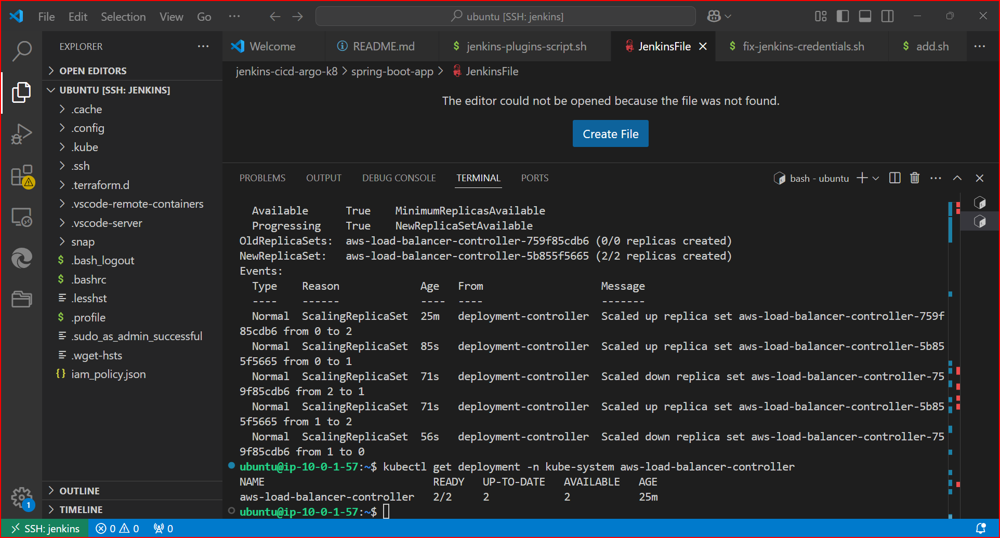
4. Install ArgoCD on EKS
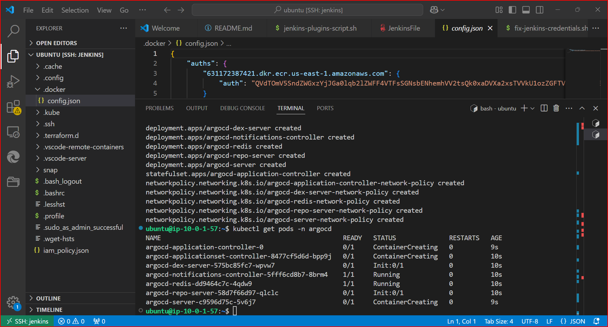
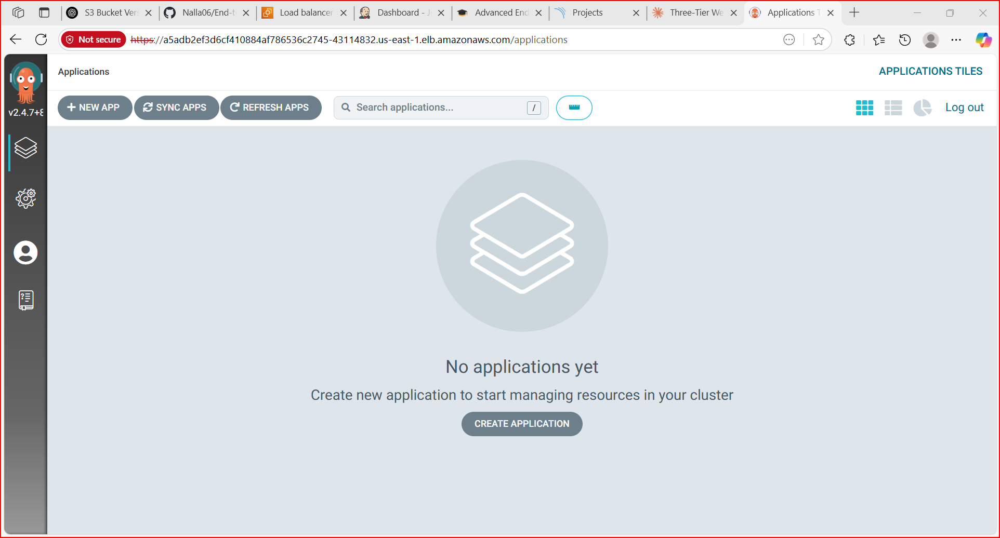
5. Load Balancer Created for ArgoCD / Ingress
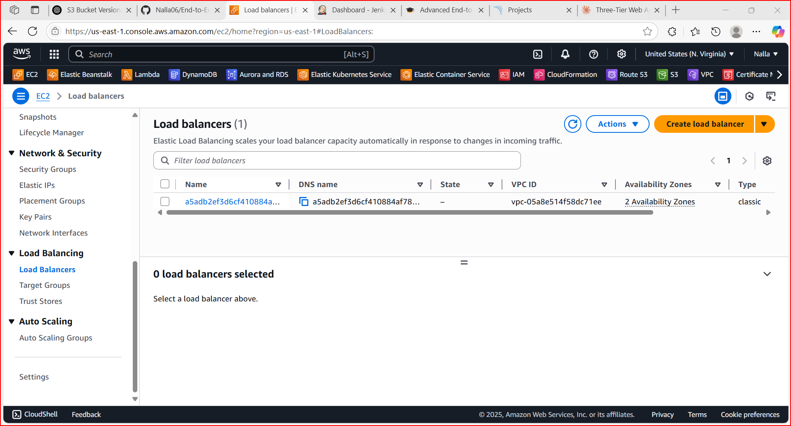
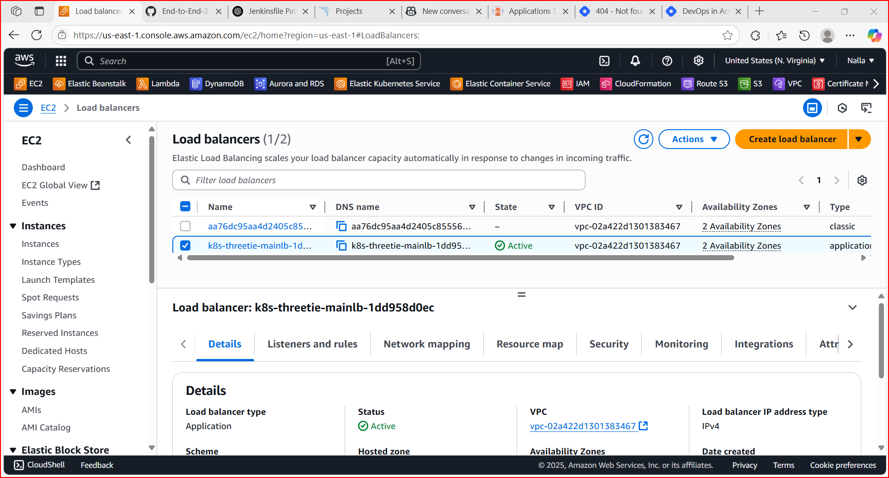
6. Configure ArgoCD Connection to Repo
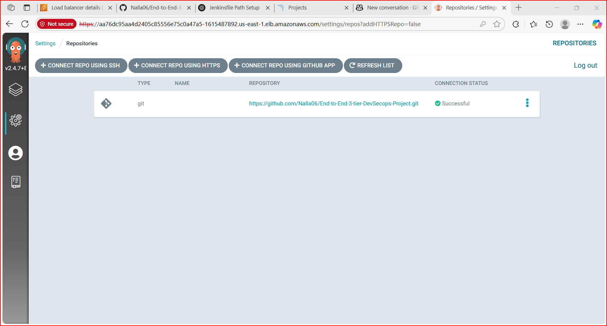
7. Jenkins Pipelines (Backend & Frontend)
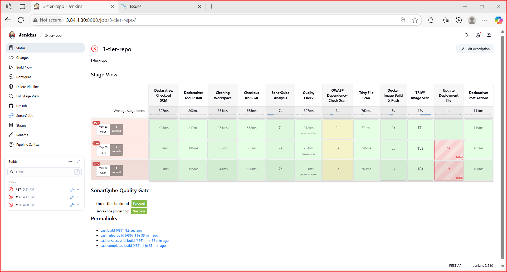
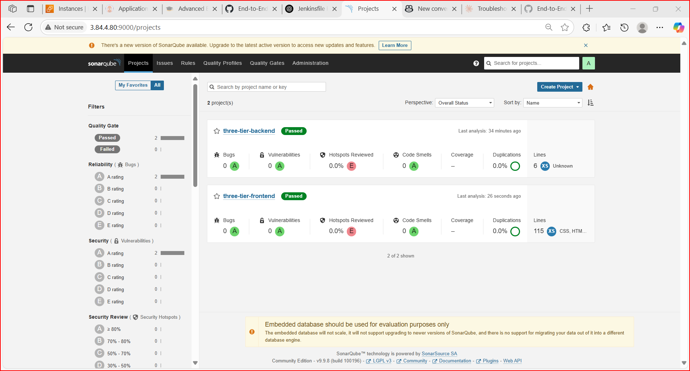
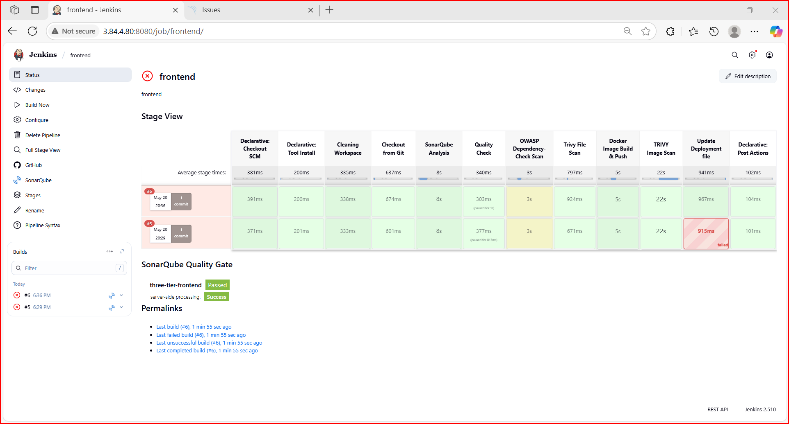
8. Final ArgoCD UI or Result
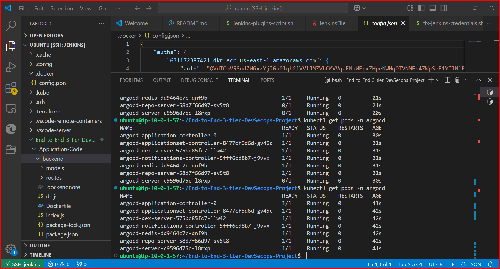
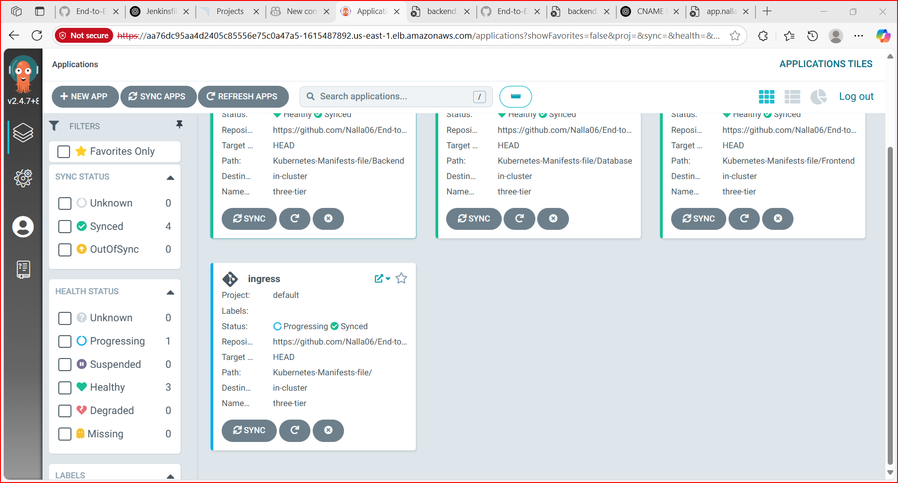

